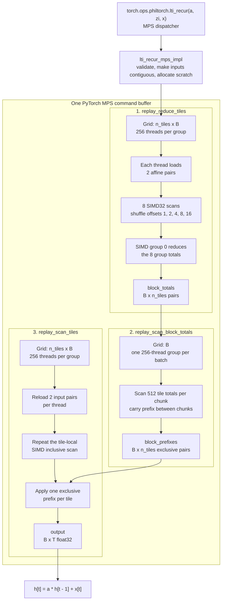

# Metal scalar recurrence implementation

This directory contains philtorch's native CPU, CUDA, and Metal sources.
The Metal implementation of the scalar linear time-invariant recurrence lives in [`lti_recur_mps_replay.mm`](lti_recur_mps_replay.mm).
It implements

```text
h[b, t] = a[b or 0] * (t == 0 ? zi[b] : h[b, t - 1]) + x[b, t]
```

as an associative affine scan.
MPS dispatch uses one three-stage hierarchical SIMD implementation that replays each tile after scanning compact tile totals.

## Source map

| File | Role |
| --- | --- |
| [`host_recur2.cpp`](host_recur2.cpp) | Defines the `philtorch::lti_recur` dispatcher schema. |
| [`lti_recur_mps_replay.mm`](lti_recur_mps_replay.mm) | Objective-C++ host code and the embedded Metal Shading Language source. |
| [`../__init__.py`](../__init__.py) | Registers fake implementations and autograd for `philtorch::lti_recur`. |
| [`../../tests/test_recur_ext.py`](../../tests/test_recur_ext.py) | Checks CPU/MPS parity, boundary lengths, long scans, and gradients. |
| [`../../benchmarks/benchmark_mps_lti_recur.py`](../../benchmarks/benchmark_mps_lti_recur.py) | Reproduces CPU/MPS runtime and working-memory results. |

## Turning a recurrence into a scan

An `AffinePair { multiplier, value }` represents the function

```text
f(h) = multiplier * h + value.
```

The Metal helper composes two adjacent functions in sequence:

```text
compose_affine(left, right)
    = (left.multiplier * right.multiplier,
       left.value * right.multiplier + right.value)
    = right(left(h)).
```

Function composition is associative, so these pairs can be evaluated with a parallel prefix scan.
Composition is not commutative; changing the operand order changes the recurrence.

For each batch, the code scans `T + 1` pairs:

```text
p[0]     = (0, zi[b])
p[t + 1] = (a[b or 0], x[b, t])
identity = (1, 0)
```

The first pair is a reset function.
Its zero multiplier makes the scan independent of any state before `zi`.
Consequently, the value in the inclusive prefix at scan index `t + 1` is exactly `h[b, t]`.
Out-of-range lanes use the identity pair, which makes partial tiles safe without a separate padding pass.

## Default execution path



Let

```text
n_steps = T + 1
n_tiles = ceil(n_steps / 512)
```

All three kernels are encoded in order into the current PyTorch MPS command buffer.
That ordering provides the dependencies between stages without a CPU round trip.

### Stage 1: reduce tiles in parallel

`replay_reduce_tiles` launches a two-dimensional grid with one threadgroup for every `(tile, batch)` pair.
A tile contains 512 affine pairs and a threadgroup contains 256 threads, so thread `lid` owns adjacent elements `2 * lid` and `2 * lid + 1`.

The threadgroup is eight 32-lane SIMD groups:

1. Each thread composes its two elements into one `thread_total`.
2. `simd_inclusive_affine` scans those totals with `simd_shuffle_up` at offsets 1, 2, 4, 8, and 16.
3. Lane 31 writes each SIMD group's total to eight entries of threadgroup memory.
4. SIMD group 0 scans those eight totals, and lane 7 writes the complete tile total to `block_totals`.

This reduction does not write per-element scan results.
Partial final tiles naturally produce the correct total because missing elements were loaded as identities.

### Stage 2: scan tile totals

`replay_scan_block_totals` launches one 256-thread threadgroup per batch.
It uses the same two-elements-per-thread SIMD hierarchy to compute the exclusive prefix for each tile.

One threadgroup scans up to 512 tile totals at a time.
If a sequence has more than 512 tiles, the kernel loops over compact 512-total chunks and carries the last inclusive result into the next chunk.
This keeps the number of Metal dispatches fixed while supporting sequences longer than `512 * 512` scan elements.
The result is stored in `block_prefixes`; the first tile receives the identity prefix.

### Stage 3: replay tiles and apply prefixes

`replay_scan_tiles` launches the same `(n_tiles, B)` grid as stage 1 and reloads the input pairs.
It repeats the SIMD hierarchy, this time reconstructing both tile-local inclusive results owned by each thread.
Thread zero loads the tile's exclusive prefix into threadgroup memory once, and every valid scan index evaluates

```text
global_pair = compose_affine(block_prefixes[b, tile],
                             tile_local_inclusive[b, t + 1])
output[b, t] = global_pair.value
```

The synthetic initial-state pair at scan index zero is not written to the output.
Replaying the scan adds SIMD arithmetic, but it rereads one 4-byte input instead of writing and rereading an 8-byte `AffinePair`.
This removes the dominant per-element scratch traffic.

## Buffers and launch geometry

An `AffinePair` is two `float` values, or 8 bytes.

| Buffer | Shape | Purpose |
| --- | --- | --- |
| `a_contiguous` | `(1,)` or `(B,)` | Shared or per-batch recurrence multiplier. |
| `zi_contiguous` | `(B,)` | Initial state. |
| `x_contiguous` | `(B, T)` | Input sequence. |
| `block_totals` | `(B, n_tiles, 2)` | One affine total per tile. |
| `block_prefixes` | `(B, n_tiles, 2)` | Exclusive affine prefix before each tile. |
| `output` | `(B, T)` | Recurrence result. |

Excluding inputs and output, scratch storage is

```text
16 * B * n_tiles bytes.
```

Ignoring compact tile metadata, dominant traffic is about 12 bytes per element: read `x` in stages 1 and 3, then write `output`.

The fixed geometry is:

| Property | Value |
| --- | --- |
| Tile size | 512 affine pairs |
| Threads per tile | 256 |
| Elements per thread | 2 |
| SIMD width | 32 lanes |
| SIMD groups per tile | 8 |
| Metal dispatches | 3 |

The host checks `threadExecutionWidth == 32` and support for at least 256 threads per threadgroup before dispatching.
The tile, threadgroup, and SIMD constants are coupled; changing one requires updating both Metal kernels and the Objective-C++ launch code.

## PyTorch and Metal integration

The `.mm` file is Objective-C++, allowing the same translation unit to use the PyTorch C++ API and Apple's Metal Objective-C API.

1. On the first call, `get_pipelines()` compiles the embedded `METAL_SOURCE` with `newLibraryWithSource` and creates all compute pipeline states.
   `dispatch_once` caches them for the process lifetime.
2. Scratch buffers are ordinary MPS tensors allocated with `at::empty`.
   This keeps allocation and lifetime management inside PyTorch.
3. `get_mtl_buffer()` obtains the underlying `MTLBuffer` from tensor storage, while `get_buffer_offset()` preserves a tensor's storage offset.
4. Inputs are made contiguous before their buffers are bound, so the kernels can use linear indexing.
5. `torch::mps::get_command_buffer()` and `get_dispatch_queue()` attach the kernels to PyTorch's current MPS stream.
   Encoding runs under `dispatch_sync`, and `torch::mps::commit()` submits the work.

The extension does not create a separate Metal device, queue, or command buffer for each operation.
It creates a device only when compiling pipelines; execution uses PyTorch's command infrastructure.

## Dispatcher and autograd

`host_recur2.cpp` defines the operator schema.
The MPS registration at the end of `lti_recur_mps_replay.mm` maps

```text
philtorch::lti_recur -> lti_recur_mps_impl
```

The public `philtorch::lti_recur` schema has a custom autograd formula in `philtorch/__init__.py`.
Its backward pass expresses reverse recurrence using the same dispatcher operation, so MPS forward and backward both reach the replay implementation.

## Why tile replay

The first pass reduces each 512-element tile without writing per-element prefixes.
After the compact tile totals are scanned, the final pass rereads the 4-byte inputs and reconstructs prefixes in registers.
Repeating SIMD arithmetic is cheaper than writing and rereading an 8-byte `AffinePair`, and scratch remains proportional to `B * ceil((T + 1) / 512)` rather than `B * T`.

## Supported inputs and edge cases

The MPS implementations currently require:

- `a`, `zi`, and `x` on an MPS device with the same dtype;
- `float32` values;
- scalar or one-dimensional `a`, containing either one value or one value per batch;
- one-dimensional `zi` with length `B`;
- two-dimensional `x` with shape `(B, T)`; and
- indexing products that fit in `uint32_t`.

An empty batch or zero-length sequence returns `empty_like(x)` without a Metal dispatch.
Shared and per-batch `a` values use one kernel and a `batched_decay` flag.
Parallel reassociation can change floating-point rounding relative to a strict serial loop, so tests use explicit `float32` tolerances.

## CPU and MPS benchmark

The following results were measured on an Apple M1 Pro with macOS `26.5.2`, PyTorch `2.10.0`, six CPU threads, and `float32` inputs:

```bash
pixi run python benchmarks/benchmark_mps_lti_recur.py
```

Input transfers are excluded.
Runtime uses `torch.utils.benchmark.Timer.blocked_autorange` for at least 500 ms and reports median latency with interquartile range in parentheses.
The MPS timer synchronizes PyTorch's MPS stream at each measurement boundary.
CPU peak memory is reconstructed from allocation events captured by `torch.profiler.profile(profile_memory=True)`.
Because PyTorch `2.10.0` does not expose MPS as a `ProfilerActivity`, MPS peak memory is sampled with `torch.mps.current_allocated_memory()` during repeated calls inside a profiler range.
Memory figures exclude inputs and allocator cache but include output and native temporary tensors.

| B | T | Coefficients | CPU median ms (IQR) | MPS median ms (IQR) | Speedup | CPU peak MiB | MPS peak MiB | Memory ratio |
| ---: | ---: | :--- | ---: | ---: | ---: | ---: | ---: | ---: |
| 1 | 4096 | shared | 0.0485 (0.0021) | 0.0274 (0.0043) | 1.77x | 0.016 | 0.016 | 0.97x |
| 1 | 262144 | shared | 0.4403 (0.0231) | 0.0446 (0.0044) | 9.88x | 1.000 | 1.008 | 0.99x |
| 16 | 4096 | batched | 0.1475 (0.0155) | 0.0284 (0.0056) | 5.20x | 0.500 | 0.252 | 1.98x |
| 64 | 65536 | batched | 2.9058 (0.3561) | 0.3285 (0.0485) | 8.85x | 32.000 | 16.126 | 1.98x |
| 256 | 4096 | batched | 1.1041 (0.2007) | 0.1365 (0.0160) | 8.09x | 8.001 | 4.035 | 1.98x |

## Build and verification

On macOS, `setup.py` adds every `.mm` source to the C++ extension and links the Foundation and Metal frameworks.
The pixi environment selects Homebrew LLVM and the Homebrew OpenMP headers needed by the other native sources.

Rebuild the editable extension after changing Objective-C++ or Metal source:

```bash
pixi reinstall philtorch
```

Run focused native recurrence tests with:

```bash
pixi run pytest tests/test_recur_ext.py -q
```

The MPS tests cover scalar, shared, and per-batch multipliers, empty sequences, lengths around the 512-element tile boundary, CPU/MPS device dispatch, and gradients against CPU.
The long replay test uses `T = 512 * 512 + 1`, forcing stage 2 to carry a prefix across more than one 512-total chunk.

## Invariants to preserve

When modifying this implementation, keep these details synchronized:

- `compose_affine(left, right)` means `right(left(h))`; do not reverse it.
- Scan index zero is `(0, zi)`, while output index `t` reads scan index `t + 1`.
- Missing elements in a partial tile must be `(1, 0)`.
- `block_prefixes` is exclusive, while replayed tile-local results are inclusive.
- The 512-element tile assumes 256 threads, two elements per thread, and eight 32-lane SIMD groups.
- The three command encoders must remain ordered: tile reduction, block-total scan, then tile replay.
- The only MPS registration is the public `philtorch::lti_recur` schema.